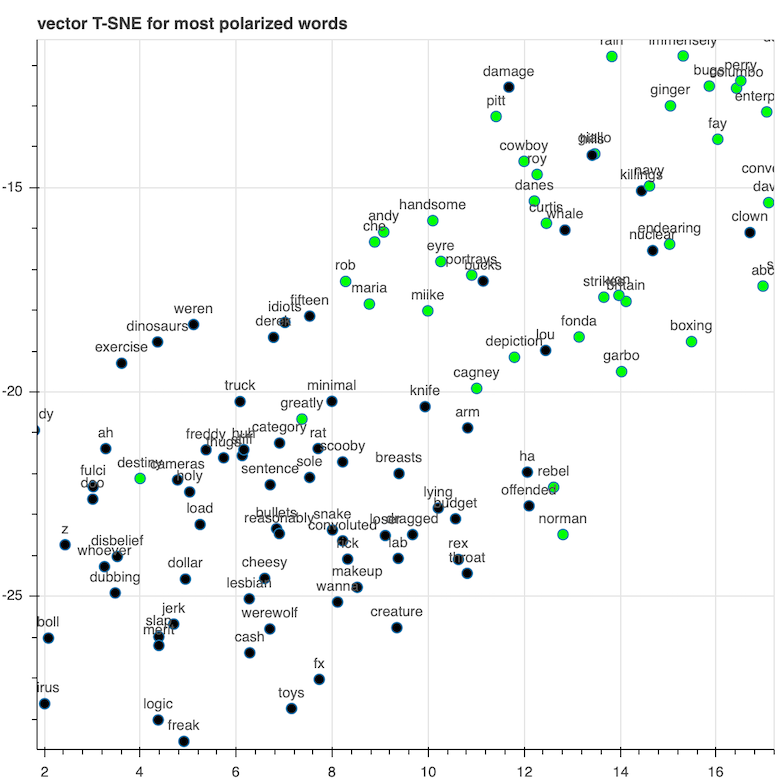

# Sentiment Analysis

## Introduction

This project was created to demonstrate how a relatively small plain neural network could achieve good results on 
simple sentiment analysis task, *i.e.* predicting whether a review is **positive** or **negative**. 

## Data

The data is composed for 25,000 different reviews with their correspondent outputs, whether if its a positive or 
negative review. The dataset can be found [here](https://drive.google.com/uc?export=download&id=14OK_8FfFdkoJUcpAl5cb0zEPcqmKUVhT)
where the `reviews.txt` contains the *training data* and the `labels.txt` the *training labels*. 

## Architecture

To show the power of simple plain neural networks, this project will have a simple network with only one hidden layer.  
The number of neurons of the hidden layer is one of the hyperparameters to be provided to **SentimentNetwork**. The 
results shown here were achieved with 10 neurons on the hidden layer. The entire network is specified on the
**SentimentNetwork** class, on the `sentiment_network.py` file, together with all the required methods for training
and prediction.

## Training and Results

This project uses the simplest network and training methods available. The training is optimized to be as fast as 
possible, avoiding noisy inputs (the inputs are filtered to only the words that matter the most to the prediction) the 
training could process over 8,000 reviews per second (including forward and backward propagation) on the CPU and with
*batch sizes* of 1. 

The training process took only one epoch and could achieve an accuracy of **85%** on the validation set. There are
a lot of improvements that could be done on this simple network, but this is a good example of how powerful are 
neural networks. All the network architecture and the training (both forward and backward propagation) were implemented
without the help of any deep learning framework, using only **numpy**.

As the input were mapped to only check for words with the most impact on predictions (on training data), the weights
of the network ended up mapping words that affects one class more than other. On the image below it's possible
to check the 2D visualization of this, showing how the words on the network's vocabulary are disposed on a 2D axis. 

Zooming in this graph it's easy to observe the impact of a couple of words on the prediction of the network (the words
that impacts **negative** reviews the best are on black and **positive** reviews on green). As the image is zoomed on
the border of these two poles (**negative** and **positive**) the words shown are not too much negative or positive,
they are almost equal, but there are a few good words to observe, such as *handsome* on the upper right and *jerk*, 
*idiots* or *freak* on the lower left part. 

## New Predictions

It's possible to test the ability of the network to predict on new reviews by using the code on `predict.py`. It's easy
and you should only call the file with the new review and the folder where the weights and parameters of the network is
saved (usually saved when training the network using `train.py`). As said before, the network and training is extremely 
simple, so feel free to run this code on your computer, it shouldn't take longer than a minute to train the network on
this training data and then start testing it on your reviews! 